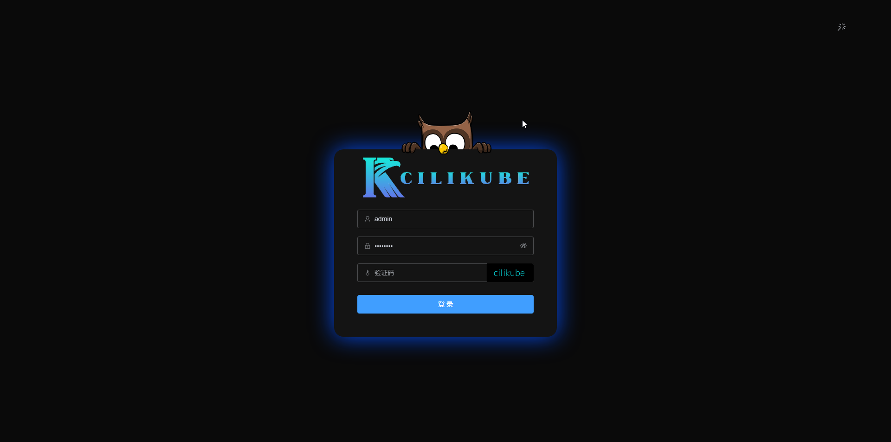
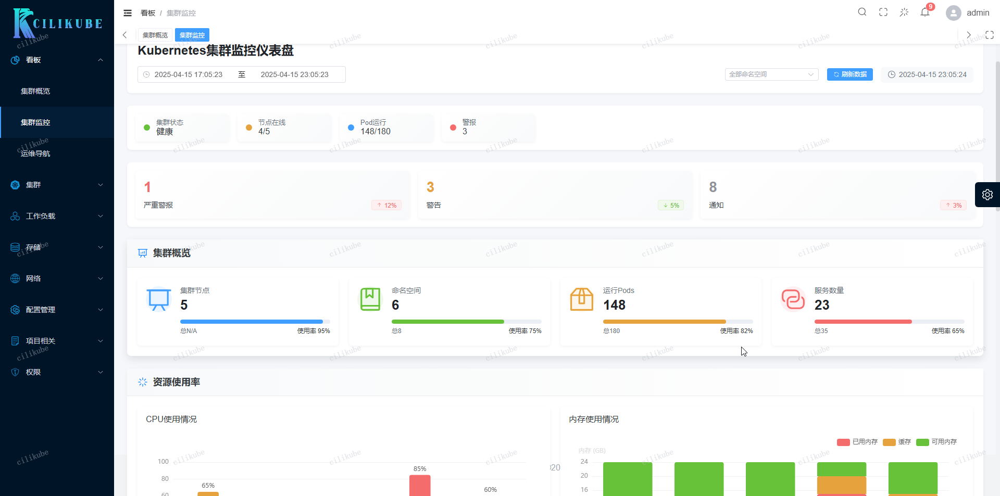
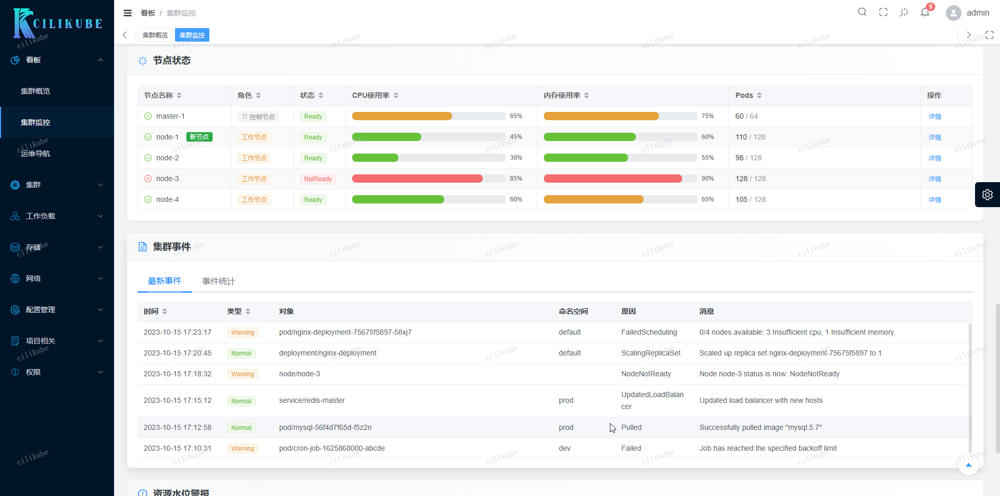
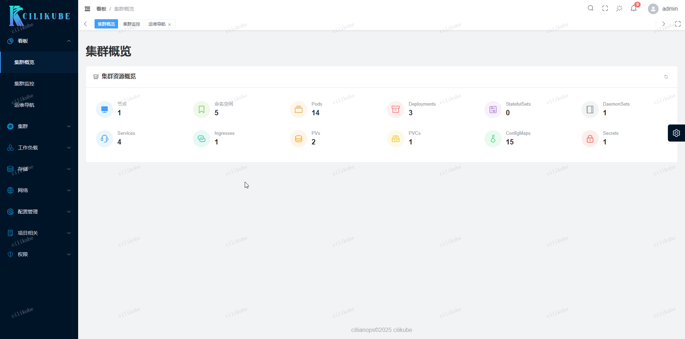
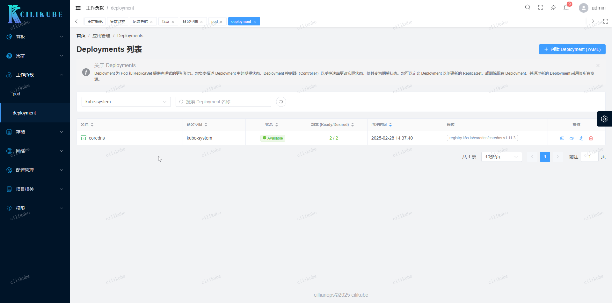
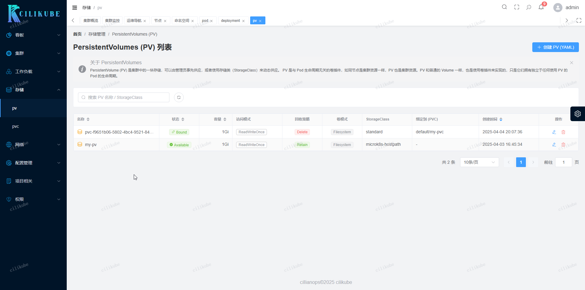
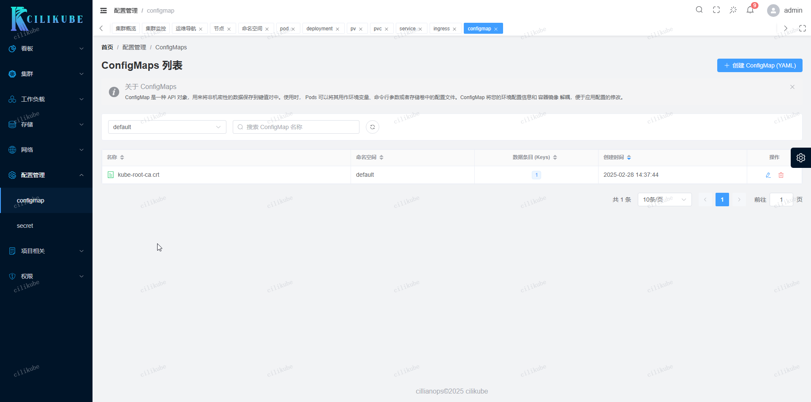

Okay, here is the English translation of the optimized README content.

<div align="center">
  
  <h1>CiliKube</h1>
  <span><a href="./README.zh-CN.md">中文</a> | English</span>
</div>

[](https://github.com/ciliverse/cilikube)
<!-- [](https://app.fossa.com/projects/git%2Bgithub.com%2Fciliverse%2Fcilikube?ref=badge_shield) -->
[](./LICENSE)


## 🤔 What is CiliKube?

CiliKube is an open-source, full-stack Kubernetes (k8s) resource management platform built with modern, mainstream technology stacks (Vue3, TypeScript, Go, Gin). It aims to provide a clean and elegant interface to simplify the daily management (CRUD operations) of Kubernetes resources and support feature expansion.

## ✨ What Makes CiliKube Special?

Unlike complex systems pursuing "large and comprehensive" features, CiliKube focuses on being "small and beautiful." Its core goals are:

1.  **Core Functionality**: Offers a clear, intuitive interface for managing common K8s resources.
2.  **Learning-Friendly**: Features clean code structure and a modern tech stack, making it an excellent starting point for learning **Vue3/Go Web Development** and **custom Kubernetes tooling/development**.
3.  **Easy to Extend**: Designed with extensibility in mind, allowing users to easily add custom features based on their needs.

## 🎯 Target Users

*   Developers looking to learn **Vue3 + TypeScript + ElementPlus** frontend development.
*   Developers looking to learn **Go + Gin** backend development.
*   Cloud-native enthusiasts interested in using the **Kubernetes API** and **client-go**.
*   Teams or individuals needing a concise K8s management dashboard with the potential for customization.

## 💡 Project Background

CiliKube originated from the author's practical project while learning full-stack web development. During the learning process, the author delved deep into Kubernetes and obtained relevant certifications. This project is not just a demonstration of learning outcomes but also aims to be a "Key," helping more learners like the author open the door to the open-source world, contribute, and grow together.

## 📚 Documentation

*   Official Documentation: [cilikube-docs.cillian.website](https://cilikube.cillian.website) (Under construction)

## 🌐 Online Demo

*   An online demo site is being deployed, stay tuned!

## 🚀 Tech Stack

This project utilizes popular frontend and backend technology stacks, ensuring developers can engage with the latest tools and libraries.

*   **Environment Requirements (Recommended)**:
    *   Node.js >= 18.0.0 (Project developed with v20.x)
    *   Go >= 1.20 (Project developed with v1.22.x)
    *   PNPM >= 8.x

*   **Frontend**: `Vue3` `TypeScript` `Vite` `Element Plus` `Pinia` `Vue Router` `Axios` `UnoCSS` `Scss` `ESlint` `Prettier`
    *   Developed based on the excellent [v3-admin-vite](https://github.com/un-pany/v3-admin-vite) template, thanks to the original author un-pany.

*   **Backend**: `Go` `Gin` `Kubernetes client-go` `JWT (dgrijalva/jwt-go)` `Gorilla Websocket` `Logger (wonderivan/logger)`

## ✨ Main Features ([See Detailed Roadmap](#-roadmap))

*   **User Authentication**: JWT-based login and authorization.
*   **Dashboard**: Cluster resource overview.
*   **Cluster Management**:
    *   Node Management
    *   Namespace Management
    *   Pod Management (List, Details, Logs, Terminal)
    *   Volume Management (PV/PVC)
    *   Configuration Management (ConfigMap/Secret)
    *   Network Management (Service/Ingress)
    *   Workload Management (Deployment/StatefulSet/DaemonSet) (Partially implemented)
*   **System Settings**: Theme switching, Internationalization (i18n) support (Planned).

## 🛠️ Roadmap

**Frontend**

*   [x] Login Page
*   [x] Basic Layout (Sidebar, Topbar, Tabs)
*   [x] Notifications
*   [ ] Workload Resource Pages (Deployment, StatefulSet, DaemonSet, etc.)
*   [ ] Configuration Management Pages (ConfigMap, Secret)
*   [ ] Network Resource Pages (Service, Ingress)
*   [ ] Storage Resource Pages (StorageClass, PV, PVC) - *PV/PVC partially done*
*   [ ] Access Control Pages (RBAC - ServiceAccount, Role, ClusterRoleBinding, etc.)
*   [ ] Events Viewer
*   [ ] Basic CRD Resource Management
*   [ ] Monitoring Integration (Display data from Prometheus/Grafana)
*   [ ] Log Viewer Enhancements
*   [ ] Web Shell Terminal Integration

**Backend**

*   [x] Kubernetes Client Initialization
*   [x] Basic Routing Setup (Gin)
*   [x] CORS Configuration
*   [x] JWT Authentication Middleware
*   [x] WebSocket Endpoint (for Logs and Web Shell)
*   [x] Node Resource API
*   [x] Pod Resource API (List, Get, Delete, Logs, Exec)
*   [x] PV/PVC Resource API
*   [ ] Namespace Resource API
*   [ ] Deployment / StatefulSet / DaemonSet Resource API
*   [ ] Service / Ingress Resource API
*   [ ] ConfigMap / Secret Resource API
*   [ ] RBAC Related Resource API
*   [ ] Event Resource API

## 💻 Local Development

**Prerequisites**

1.  Install [Node.js](https://nodejs.org/) (>=18) and [pnpm](https://pnpm.io/)
2.  Install [Go](https://go.dev/) (>=1.20)
3.  Have a Kubernetes cluster and configure your `kubeconfig` file (reads `~/.kube/config` by default)

**Run Frontend**

```bash
# Enter frontend directory
cd ui

# Install dependencies
pnpm install

# Start development server
pnpm dev
```
**Run Backend**
```bash
# Enter backend directory
cd server

# (Optional) Update Go dependencies
# go mod tidy

# Run backend service (listens on port 8081 by default)
go run main.go
```
**Build Project**
```bash
# Build frontend for production (output to ui/dist)
cd ui
pnpm build

# Build backend executable
cd ../server
go build -o cilikube-server main.go
```

**Run Tests (Frontend)**
```bash
cd ui
pnpm test:unit
```

**Lint Code (Frontend)**
```bash
cd ui
pnpm lint
```
## 🎨 Feature Preview















## 🤝 Contribution Guide

We welcome contributions of all forms! If you'd like to help improve CiliKube, please:

Fork this repository

Create your feature branch (git checkout -b feature/AmazingFeature)

Commit your changes (git commit -m 'feat: Add some AmazingFeature') - Please follow the Git Commit Guidelines

Push your branch to your fork (git push origin feature/AmazingFeature)

Submit a Pull Request

## Git Commit Guidelines

Please follow the Conventional Commits specification:

- feat: Add new features

- fix: Fix issues/bugs

- perf: Optimize performance

- style: Change the code style without affecting the running result

- refactor: Refactor code

- revert: Revert changes

- test: Test related, does not involve changes to business code

- docs: Documentation and Annotation

- chore: Updating dependencies/modifying scaffolding configuration, etc.

- workflow: Workflow Improvements

- ci: CICD related changes

- types: Type definition changes

- wip: Work in progress (should generally not be merged)

## ❤️ Support the Project

Open source is not easy. If you find CiliKube helpful or inspiring, please consider giving it a Star ⭐! Your encouragement is the primary motivation for the author to maintain and update the project regularly.

Follow the WeChat Official Account 希里安 (cilliantech) to get the latest project updates and tech sharing!

(Consider adding the WeChat QR code image here)

## 📞 Contact

Email: cilliantech@gmail.com

Website: https://www.cillian.website

WeChat: cilliantech

## 📜 License

This project is open-sourced under the Apache 2.0 License.

Copyright (c) 2024-present cillianops

## 🌟 Star History
<a href="https://star-history.com/#ciliverse/cilikube&Date">
 <picture>
   <source media="(prefers-color-scheme: dark)" srcset="https://api.star-history.com/svg?repos=ciliverse/cilikube&type=Date&theme=dark" />
   <source media="(prefers-color-scheme: light)" srcset="https://api.star-history.com/svg?repos=ciliverse/cilikube&type=Date" />
   
 </picture>
</a>